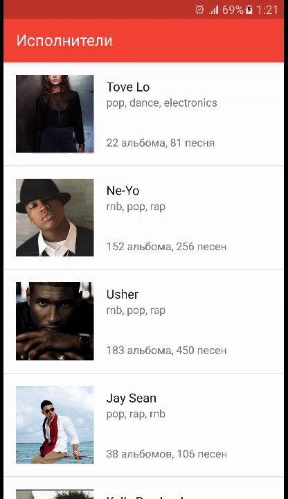

# Artist Explorer

A demo applicaton designed for [Yandex Mobilizatoin 2016](https://academy.yandex.ru/events/mobdev/msk-2016/).

## Description

Displays information about pop musicians.

Downloads data as a JSON file, parses and caches it.
Supports multiple languages, screen orientations and performs error handling.
Also contains examples of Unit and UI tests.
More information might be found in detailed comments in the source code.

## Third-Party Libraries

* [OkHttp](https://github.com/square/okhttp) for downloading raw data file
* [Fresco](https://github.com/facebook/fresco) for downloading and caching images
* [Fastjson](https://github.com/alibaba/fastjson) for parsing JSON data
* [PowerMock](https://github.com/jayway/powermock) for mocking static methods in Unit tests

## Download

[Artist Explorer.apk](app/apk/Artist Explorer.apk)

## Preview

<i>Fragments transition</i>

 

<i>Artist information in portrait orientation</i>

 

<i>Artist information in landscape orientation</i>

 

<i>Handling connection errors</i>

